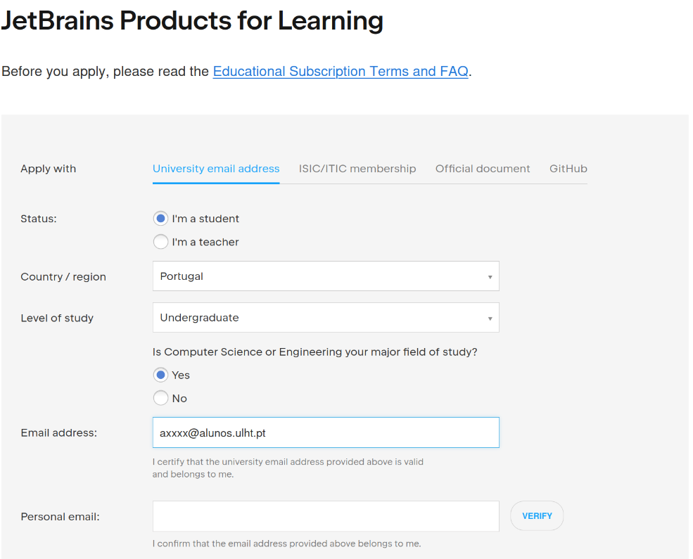

# PyCharm + Jupyter Notebooks Installation Guide

**This guide is for `Windows`, `macOS`, and `Linux` operating systems.**

This guide assumes that you already have Python installed. If not, visit  
> **https://www.python.org/downloads/**

**PyCharm** is an IDE developed by JetBrains for Python development.
- **Community Edition (free)** – No native support for Jupyter Notebooks.
- **Professional Edition (free with educational account)** – Includes native support for **Jupyter Notebooks** and data science tools.

> **Important:** Working with `.ipynb` (Jupyter Notebook) files inside PyCharm requires **PyCharm Professional**.

## University Institutional Email

- Username: axxxxxxxx@alunos.ulht.pt (example: a20164565@alunos.ulht.pt)
- Password: Same as used for netPA access.

For more information, check:
> **https://www.ulusofona.pt/faqs/estudantes/questoes-administrativas/como-obtenho-o-meu-endereco-de-e-mail-como-estudante-da-universidade-lusofona**

## PyCharm Educational Account

As a student, you can obtain a free annual license for PyCharm Professional:
> **https://www.jetbrains.com/shop/eform/students**



## GitHub Student Account

Another way to validate your PyCharm educational account is through the GitHub Student Account.

To get a GitHub Student Account, visit:
> **https://github.com/settings/education/benefits**

Once your account is validated, access:
> **https://www.jetbrains.com/shop/eform/students**


---

> **Important:** Validation takes some time. While you wait, you can use the **30-day Trial Version**.

---

## Table of Contents
- [1. Download](#1-download)
- [2. Installation by Operating System](#2-installation-by-operating-system)
  - [2.1 Windows](#21-windows)
  - [2.2 macOS](#22-macos)
  - [2.3 Linux](#23-linux)

---

## 1. Download

- **PyCharm:** [https://www.jetbrains.com/pycharm/download](https://www.jetbrains.com/pycharm/download)  
---

## 2. Installation by Operating System

### 2.1 Windows
1. Download the `.exe` installer.
2. Run it and follow the wizard:
   - Next → choose installation directory
   - (Optional) create shortcut, add to PATH
   - Install.
3. Open the application.

### 2.2 macOS
1. Download the `.dmg` file.
2. Drag the icon to **Applications**.
3. Open via Launchpad / Finder.
4. If blocked by Gatekeeper → **System Settings → Privacy & Security → Open Anyway**.

### 2.3 Linux
#### Method A (Snap, Ubuntu and derivatives)
```bash
# PyCharm
sudo snap install pycharm-professional --classic
