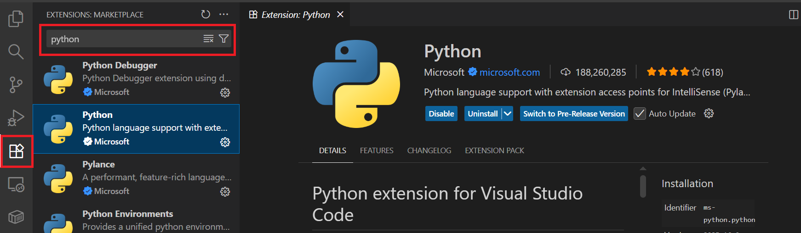
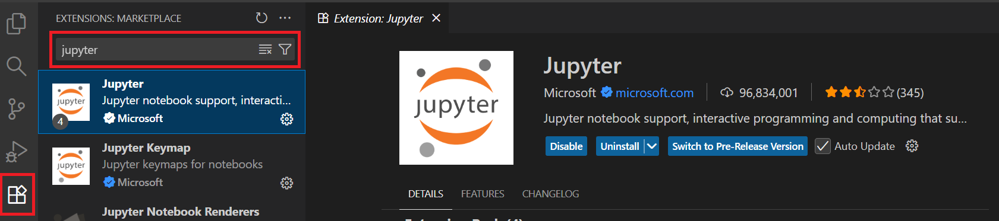

# Visual Studio Code Setup Guide  
*Configuration for Python & Jupyter Notebooks*

---

## 🛠 1. Download and Install Visual Studio Code

Download VS Code from the official website:  
🔗 **https://code.visualstudio.com/download**

---

## 🧩 2. Required Extensions

To work with Python and Jupyter notebooks, install the following extensions:

---

### 🐍 Python Extension  
Provides Python language support, IntelliSense, and debugging.

_Search in Extensions: **"Python"**_  
 

---

### 📓 Jupyter Extension  
Enables `.ipynb` notebook support inside VS Code.

_Search in Extensions: **"Jupyter"**_  
 

---

## 🐍 3. Select Python Interpreter

1️⃣ Press **Ctrl + Shift + P**  
2️⃣ Search for: **"Python: Select Interpreter"**  
3️⃣ Choose your Python or Conda environment

---

## 📓 4. Create or Open a Notebook

To create a new Jupyter Notebook:

Or open any existing `.ipynb` file directly.

---

## ✅ Setup Complete!

You are now ready to use **VS Code** for Python and Data Science development.  
Happy coding! 🚀

---

> 💡 **Tip:** If you have Anaconda installed, you can select your Conda environment as the interpreter.

